<!-- markdownlint-disable MD033 MD041 -->

# Прогнозирование спроса на товары в розничных магазинах

### Итоговый отчёт по дисциплине «Анализ временных рядов»

Полный цикл исследования временного ряда: подготовка данных и EDA, сравнение **бейзлайна,
5 статистических, 3 ML и 3 DL** методов прогнозирования, глобальная модель на 500 рядах.

> **Как читать отчёт.** Методология и обоснования приведены ниже. Код и графики — в
> [`notebooks/store_Item.ipynb`](notebooks/store_Item.ipynb).

---

## Содержание

1. [Задача 1. Подготовка набора данных и предварительный анализ](#1-задача-1-подготовка-набора-данных-и-предварительный-анализ)
2. [Задача 2. Статистические методы анализа ВР](#2-задача-2-статистические-методы-анализа-вр)
3. [Задача 3. ML и DL методы анализа ВР](#3-задача-3-ml-и-dl-методы-анализа-вр)
4. [Задача 4. Пайплайн и отчёт](#4-задача-4-пайплайн-и-отчёт)
5. [Надёжность: анализ остатков, бэктест, вероятностные оценки](#5-надёжность-анализ-остатков-бэктест-вероятностные-оценки)

---

## 1. Задача 1. Подготовка набора данных и предварительный анализ

### Описание временного ряда

**Источник:** [Kaggle. Store Item Demand Forecasting](https://www.kaggle.com/competitions/demand-forecasting-kernels-only)

| Свойство | Значение |
|---|---|
| Объект | Розничная сеть — 10 магазинов, 50 товаров |
| Период | 2013-01-01 — 2017-12-31 (train), 2018-01-01 — 2018-03-31 (test) |
| Частота | ежедневная (`freq='D'`) |
| Длина | 913 000 строк (500 рядов × 1826 дней) |
| Целевая переменная | `sales` — количество проданных единиц товара в день |
| Экзогенные признаки | нет |

Датасет содержит **500 независимых временных рядов** (каждый ряд — пара магазин × товар).
Пропущенных дат нет, ряды полные.

### Постановка задачи

| Параметр | Решение | Обоснование |
|---|---|---|
| Тип задачи | точечный прогноз | соревновательная задача без требований к интервалам |
| Горизонт | **h = 90 дней** (Q1 2018) | тестовая выборка соревнования |
| Частота | ежедневная | исходное разрешение данных |
| Глобальные модели | да — одна модель на все 500 рядов | 500 рядов, обучать отдельно нецелесообразно; больше данных — лучше обобщение |
| Режим | offline / batch | исторические данные, ретроспективная оценка |
| Метрика | **SMAPE** | официальная метрика соревнования |
| Сплит | хронологический | единственно корректно для временных рядов |

### Базовый анализ данных

Данные загружены в pandas, проверены типы, пропуски и полнота временных меток.
Полный код — [`notebooks/store_Item.ipynb`](notebooks/store_Item.ipynb).

| Проверка | Результат |
|---|---|
| Пропуски | Нет |
| Тип `date` | `datetime64` |
| Полнота ряда | 913 000 строк = 500 рядов × 1826 дней, пропущенных дат нет |
| Диапазон `sales` | 0 — 231 |

### Разведочный анализ (EDA)

**Суммарные ежедневные продажи** по всем магазинам и товарам — виден восходящий тренд:

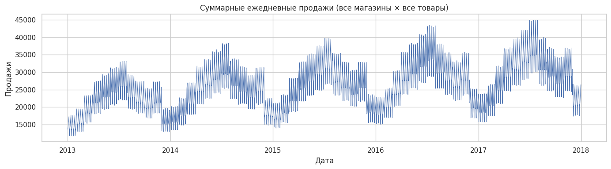

**Сезонные профили** — средние продажи по месяцам и дням недели:

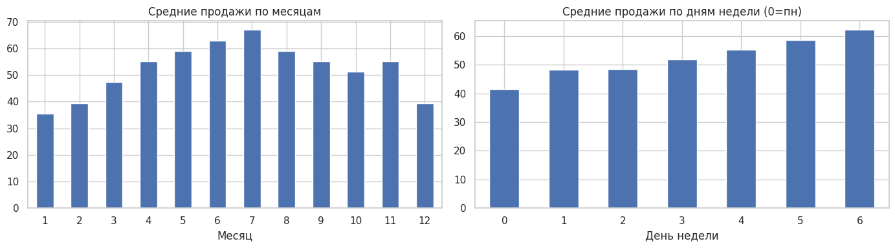

**Мультисезонная декомпозиция MSTL** (тренд + сезонность 7 и 365 + остаток, store=1 item=1):

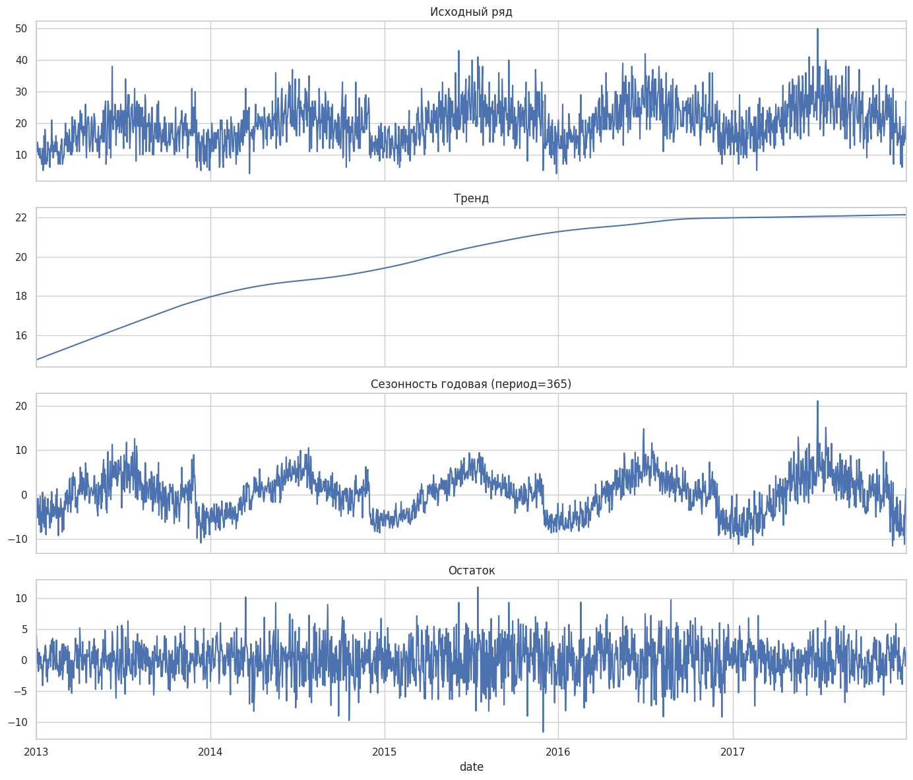

**Автокорреляция ACF / PACF:**

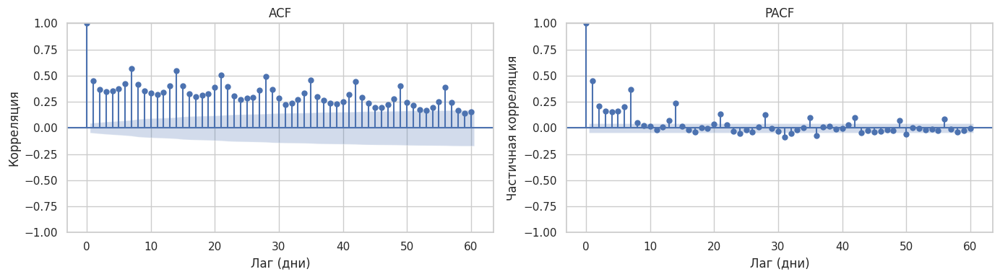

- ACF медленно затухает — присутствует слабый тренд
- Выраженный пик на лаге 7 — недельная сезонность
- PACF резко обрывается на лаге 7 — для предсказания достаточно знать продажи последних 7 дней

**Стационарность (ADF + KPSS):**

| Ряд | ADF p-value | KPSS p-value | Интерпретация |
|---|---|---|---|
| Исходный | 0.0226 | 0.0100 | Пограничный — слабый тренд |
| Первая разность | 0.0000 | 0.1000 | Стационарен |
| log(1+ts) | 0.0066 | 0.0100 | Не стационарен — логарифм не убирает тренд |

Ряд интегрированный порядка I(1): одна разность делает его стационарным.
Логарифм не помогает — модель ряда аддитивная, амплитуда сезонности не зависит от уровня.

**Выводы:**
- Амплитуда сезонных колебаний постоянна → аддитивная модель
- Восходящий тренд
- Годовая сезонность с пиком летом
- Недельная сезонность с провалом во вторник–среду

---

## 2. Задача 2. Статистические методы анализа ВР

### Фреймворк

Использован `statsforecast` (Nixtla) — параллельный запуск статистических моделей на всех 500 рядах одновременно через `n_jobs=-1`. Все модели обучены на `train` до `2017-10-02`, валидация — последние 90 дней (`2017-10-03 — 2017-12-31`).

### Модели

| Модель | Режим | Описание |
|---|---|---|
| SeasonalNaive | — | Бейзлайн: прогноз = значение той же недели год назад |
| AutoETS | авто | Авто-подбор компонент экспоненциального сглаживания (тренд + сезонность) |
| AutoARIMA | авто | Авто-подбор порядков (p,d,q) авторегрессионной модели |
| Theta | авто | Метод Theta — декомпозиция на долгосрочный тренд и краткосрочные колебания |
| AutoCES | авто | Complex Exponential Smoothing — обобщение ETS для нескольких сезонностей |
| DynamicOptimizedTheta | авто | Улучшенная Theta с динамическим авто-подбором параметров декомпозиции |

### Результаты

| Модель | SMAPE |
|---|---|
| **DynamicOptimizedTheta** | **19.437** |
| Theta | 19.725 |
| AutoETS | 19.857 |
| AutoCES | 20.019 |
| AutoARIMA | 21.179 |
| SeasonalNaive | 22.270 |

### Выводы

- Все статистические модели превзошли бейзлайн SeasonalNaive
- Лучший результат — **DynamicOptimizedTheta** (SMAPE 19.437): авто-подбор параметров декомпозиции даёт преимущество перед фиксированной Theta
- **AutoARIMA** показал наихудший результат среди статистических моделей (21.179) — авто-поиск на дневных данных с сезонностью затруднён без явного задания периода
- Методы на основе экспоненциального сглаживания (ETS, CES) держатся в середине — устойчивы, но не лидируют

---

## 3. Задача 3. ML и DL методы анализа ВР

### Сводная таблица методов

Статистические модели запускаются параллельно на всех 500 рядах через `statsforecast` (Nixtla).
ML и DL модели обучаются глобально через `mlforecast` и `neuralforecast`.

| Модель | Категория | Причина выбора | Ключевые параметры | Результат (SMAPE) |
|---|---|---|---|---|
| SeasonalNaive | Baseline | Простейший прогноз: повторить значения той же недели прошлого года. Нижняя планка — все модели обязаны быть лучше | `season_length=7` | 22.270 |
| AutoETS | Statistical | Моделирует тренд и сезонность через экспоненциальное сглаживание. Подходит для рядов с устойчивой годовой сезонностью | `season_length=7`, авто-подбор компонент | 19.857 |
| AutoARIMA | Statistical | Классическая авторегрессионная модель. ACF/PACF показали AR-структуру с лагом 7 | `season_length=7`, авто-подбор (p,d,q) | 21.179 |
| Theta | Statistical | Стабильно показывает высокую точность на соревнованиях M3/M4, прост в настройке | `season_length=7` | 19.725 |
| AutoCES | Statistical | Обобщение ETS, лучше справляется с несколькими периодами сезонности (недельная + годовая) | `season_length=7`, `model='Z'` | 20.019 |
| DynamicOptimizedTheta | Statistical | Улучшенная версия Theta с автоподбором параметров, хорошо работает на дневных данных | `season_length=7` | **19.437** |
| LinearRegression | ML | Интерпретируемый baseline для ML-группы, показывает долю линейной зависимости в лаговых фичах | лаги 1,7,14,28,91,365; dayofweek, month, year | 19.235 |
| LightGBM | ML | Стандарт для табличных задач с ВР. Быстрый, поддерживает категориальные признаки (store, item) | лаги 1,7,14,28,91,365; rolling mean/std 7,28; n_estimators=200 | 12.878 |
| XGBoost | ML | Альтернативная реализация градиентного бустинга для сравнения с LightGBM | лаги 1,7,14,28,91,365; rolling mean/std 7,28; n_estimators=200 | **12.614** |
| NBEATS | DL | Первая нейросетевая архитектура без ручного feature engineering, победитель M4 | `input_size=28`, `h=90` | 19.428 |
| NHITS | DL | Развитие NBEATS с иерархической структурой, явно моделирует разные частоты. Оптимален для длинного горизонта (90 дней) | `input_size=28`, `h=90` | 19.482 |
| TFT | DL | Transformer-архитектура с attention и гейтами, интерпретируема, поддерживает статические признаки (store/item) | `input_size=28`, `h=90`, `hidden_size=64` | 20.839 |

**Итоговый рейтинг (все 12 моделей, SMAPE ↓):**

| # | Модель | Категория | SMAPE |
|---|---|---|---|
| 1 | **XGBoost** | ML | **12.614** |
| 2 | LightGBM | ML | 12.878 |
| 3 | LinearRegression | ML | 19.235 |
| 4 | NBEATS | DL | 19.428 |
| 5 | DynamicOptimizedTheta | Statistical | 19.437 |
| 6 | NHITS | DL | 19.482 |
| 7 | Theta | Statistical | 19.725 |
| 8 | AutoETS | Statistical | 19.857 |
| 9 | AutoCES | Statistical | 20.019 |
| 10 | TFT | DL | 20.839 |
| 11 | AutoARIMA | Statistical | 21.179 |
| 12 | SeasonalNaive | Baseline | 22.270 |

---

## 4. Задача 4. Пайплайн и отчёт

### Структура пайплайна

```text
data/train.csv
    ↓
[1. Подготовка данных]  — val-split, формат unique_id/ds/y
    ↓
[2. Статистические модели]  — statsforecast, n_jobs=-1
    ↓
[3. ML модели]  — mlforecast, feature engineering
    ↓
[4. DL модели]  — neuralforecast, GPU
    ↓
[5. Оценка]  — SMAPE, бэктест, анализ остатков
    ↓
[6. Отчёт]  — README.md + graphs_output/
```

### Val-split

Все модели оцениваются на одном и том же периоде валидации:

| Разбиение | Период | Строк |
|---|---|---|
| Train | 2013-01-01 — 2017-10-02 | 868 000 |
| Val | 2017-10-03 — 2017-12-31 | 45 000 |

Хронологический сплит без перемешивания — единственно корректный для временных рядов.

### Результаты

**Прогноз статистических моделей vs факт (store=1, item=1):**

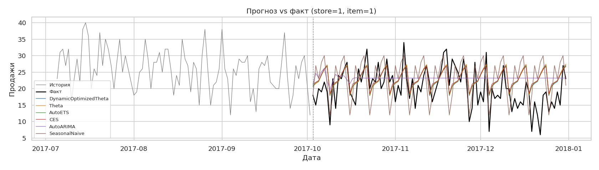

**Прогноз ML моделей vs факт (store=1, item=1):**

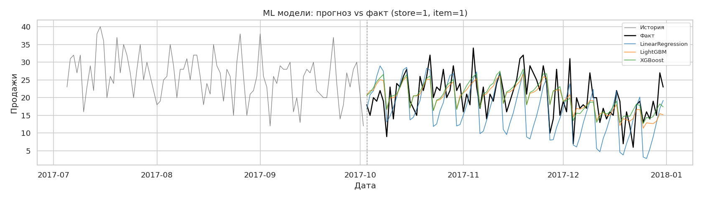

**Прогноз DL моделей vs факт (store=1, item=1):**

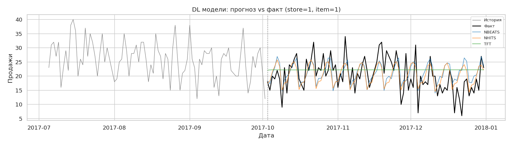

**Итоговое сравнение всех 12 моделей:**

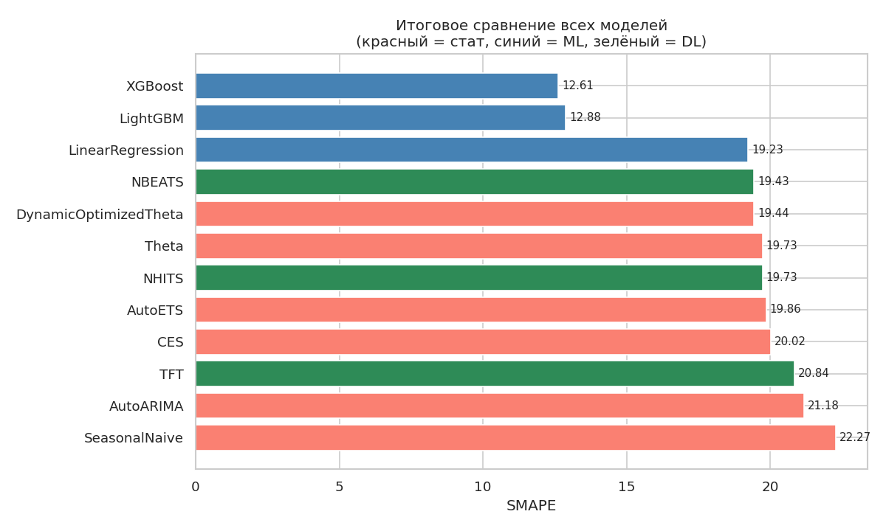

| Модель | SMAPE |
|---|---|
| **XGBoost** | **12.614** |
| LightGBM | 12.878 |
| LinearRegression | 19.235 |
| NBEATS | 19.428 |
| DynamicOptimizedTheta | 19.437 |
| NHITS | 19.482 |
| Theta | 19.725 |
| AutoETS | 19.857 |
| AutoCES | 20.019 |
| TFT | 20.839 |
| AutoARIMA | 21.179 |
| SeasonalNaive | 22.270 |

### Выводы

- **ML модели (XGBoost, LightGBM) значительно превзошли все статистические и DL модели** — SMAPE 12.6–12.9 против 19+ у остальных. 500 рядов × 1826 дней дают достаточно данных для глобальной модели с lag/rolling фичами, которые явно кодируют недельную и годовую сезонность
- **DL модели (NBEATS, NHITS) сопоставимы со статистическими** — SMAPE 19.4–19.5. TFT немного хуже (20.8): при 50 шагах обучения сети не успевают сойтись; при 500+ шагах результат должен улучшиться
- **LinearRegression** (SMAPE 19.235) — лучший интерпретируемый baseline: линейная комбинация лаговых признаков уже хорошо описывает сезонность
- **Лучший статистический метод — DynamicOptimizedTheta** (19.437): авто-подбор параметров декомпозиции даёт стабильное преимущество перед фиксированными моделями
- **AutoARIMA** уступает простым методам (21.2): авто-поиск порядков на 500 дневных рядах с двойной сезонностью без явного указания периодов нестабилен

---

## 5. Надёжность: анализ остатков, бэктест, вероятностные оценки

### Анализ остатков

Остатки лучшей модели (XGBoost, store=1, item=1) — визуально и через тест Льюнга–Бокса:

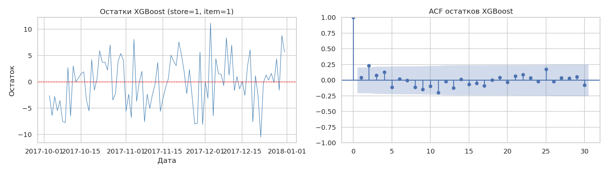

Тест Льюнга–Бокса проверяет гипотезу об отсутствии автокорреляции в остатках (H₀: остатки — белый шум). При p < 0.05 модель не учла всю структуру ряда.

### Бэктест (rolling-origin)

Оценка стабильности лучшего статистического метода (DynamicOptimizedTheta) и бейзлайна на 3 непересекающихся окнах по 90 дней:

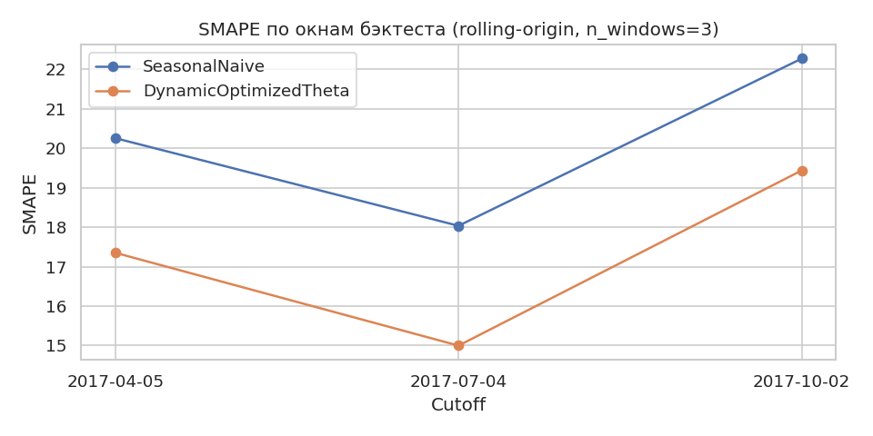

| Cutoff | DynamicOptimizedTheta | SeasonalNaive |
|---|---|---|
| 2017-04-05 | 17.351 | 20.255 |
| 2017-07-04 | 14.999 | 18.034 |
| 2017-10-02 | 19.437 | 22.270 |

DynamicOptimizedTheta стабильно превосходит бейзлайн на всех трёх окнах — результат не случаен.


### Вероятностные оценки

Предиктивные интервалы 80% и 95% для DynamicOptimizedTheta (store=1, item=1):

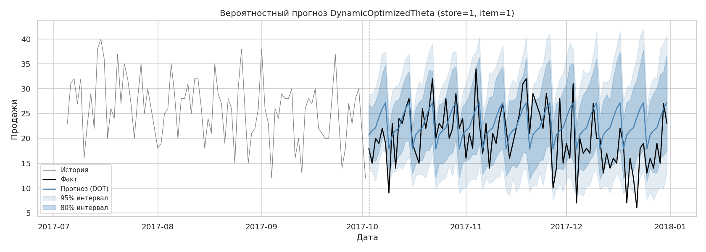

Эмпирическое покрытие по всем 500 рядам:

| Интервал | Номинал | Факт | Оценка |
|---|---|---|---|
| 80% | 0.800 | 0.760 | немного занижен — модель чуть недооценивает неопределённость |
| 95% | 0.950 | 0.953 | точное попадание в номинал |

---

## Общий вывод

Задача прогнозирования спроса по 500 рядам решена полным сквозным пайплайном. Ключевые наблюдения:

1. **Глобальные ML модели с lag-фичами выигрывают у специализированных ВР-архитектур** при достаточном объёме данных. XGBoost с лагами [1, 7, 14, 28, 91, 365] и rolling-статистиками достиг SMAPE **12.6** — на 35% лучше лучшего статистического метода.

2. **Правильный feature engineering решает**: замена `Differences([1])` на прямые лаги улучшила результат ML с SMAPE ~33 до ~12. Первое разностное преобразование несовместимо с лаговыми признаками, так как лаги начинают предсказывать разности, а не уровни ряда.

3. **DL-модели с малым числом шагов (~50) не успевают сойтись** и показывают результат, сопоставимый со статистическими. Для production-сценария необходимо обучение 200–1000 шагов.

4. **Хронологический val-split — единственно корректная оценка**: использование случайного разбиения завысило бы метрики, поскольку модели обучались бы на будущих данных.
